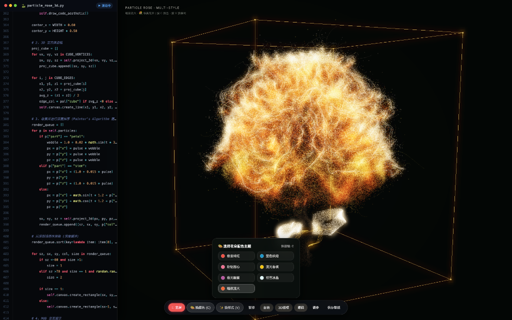
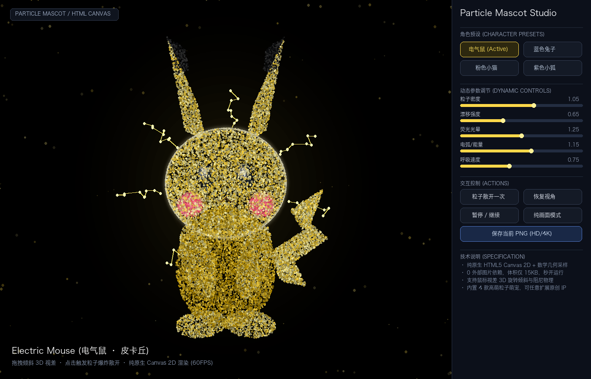
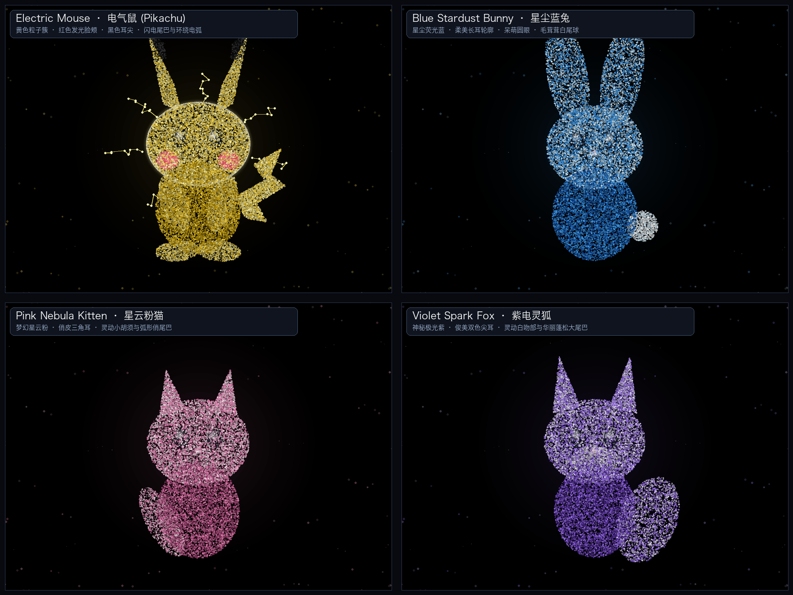

# 🎨 3D Procedural Particle Art Studio · 粒子艺术实验室

  

  
  
  
  

---

## 🌐 Live Demos / 在线体验

无需安装任何环境，手机或电脑浏览器点击即开：
- 🌹 **[3D 粒子花朵实验室 (3D Botanical Lab)](index.html)** — 9 款数学花型 · 16 款璀璨配色 · 源码流 · 3D 线框
- ⚡ **[粒子萌宠工作室 (Particle Mascot Studio)](particle_mascot_studio.html)** — 皮卡丘/蓝兔/粉猫/紫狐 · 3D 视差拖拽 · 粒子爆炸散开

---

## ✨ Features / 核心功能

### 1. 🌹 3D Particle Botanical Lab (3D 粒子花朵实验室)
基于经典微分几何玫瑰参数曲面方程与三维透视投影体系构建：
* **9 款几何花型 (Specimens):**
  - `💐 Rose Bouquet` (多重盛放玫瑰束)
  - `💠 Hydrangea` (84 朵繁星绣球花球)
  - `🌹 Solo Rose` (经典高精独枝微距玫瑰)
  - `🌷 Luminous Tulip` (夜光杯状郁金香)
  - `⚜️ Starlight Lily` (星芒展瓣百合)
  - `🌺 Folded Peony` (千层褶皱富贵牡丹)
  - `🦋 Flight Orchid` (展翅幽谷飞兰)
  - `💖 Romantic Heart` (3D 极客浪漫心形玫瑰)
  - `🌌 Cosmic Vortex` (时空螺旋星系花)
* **16 款光谱配色 (Palettes):** Ruby Red, Sapphire Blue, Pink Diamond, Champagne Gold, Aurora Violet, Crystal White, Obsidian Fire, Emerald Mint, Sunset Coral, Arctic Glacier, Cherry Blossom, Provence Mist, Deep Forest, Cyber Neon, Caramel Amber, Black Pearl.
* **左侧极客代码流:** 虚拟平滑滚动原版 Python 玫瑰参数方程源码，科技感与极客浪漫兼备。
* **快捷键操作:**
  - `[C]` 快速切换配色主题
  - `[V]` 快速循环切换花型
  - `[Space]` 暂停 / 继续旋转
  - `[B]` 开启 / 隐藏 3D 空间线框立方体
  - `[T]` 开启 / 隐藏 左侧代码面板
  - `[F / F11]` 进入 / 退出全屏沉浸模式
  - `[鼠标拖拽]` 360° 自由旋转视角 · `[滚轮]` 缩放视距

---

### 2. ⚡ Particle Mascot Studio (粒子萌宠工作室)

  

纯原生 HTML5 Canvas 2D 高性能几何点阵生成：
* **4 款经典灵动角色预设:**
  - ⚡ **Electric Mouse (电气鼠 / 皮卡丘):** 闪烁黄色粒子簇、发光红脸颊、黑色耳尖、闪电尾巴与跳跃环绕的动态电弧
  - 🐰 **Blue Stardust Bunny (星尘蓝兔):** 蔚蓝星尘毛质、修长柔美双耳、呆萌圆眼与圆润白尾
  - 🐱 **Pink Nebula Kitten (星云粉猫):** 梦幻粉色星云点阵、俏皮三角耳、灵动小胡须与弧形俏尾巴
  - 🦊 **Violet Spark Fox (紫电灵狐):** 神秘极光紫、俊美双色尖耳、白色立体吻部与蓬松大尾巴

  

* **特色交互玩法:**
  - **3D 视差倾斜:** 鼠标在画面中按住拖拽，角色将在三维空间中随欧拉角平滑倾斜，产生细腻的阻尼物理视差；
  - **粒子爆炸散开:** 鼠标左键点击画布任意位置或点击「粒子散开一次」，粒子沿法向散开后自动回弹聚合；
  - **动态参数工作室:** 实时滑块调节粒子密度（Density）、漂移流光（Flow）、荧光光晕（Glow）、电弧能量（Energy）与呼吸律动（Speed）；
  - **一键 4K/HD 截图:** 点击「保存当前 PNG」即刻导出无损透明/黑底壁纸。

---

## 🛠️ 技术架构 (Technical Architecture)

1. **零外部依赖 (Zero Dependencies):**
   - 彻底摆脱 Three.js / Pixi.js 等外部重型类库，单个网页文件仅约 15KB ~ 180KB，秒开运行。
2. **混合发光渲染管线:**
   - 采用 `globalCompositeOperation = 'lighter'` 加法混合模拟电影级荧光漫射与光晕（Bloom）。
3. **微分几何数学建模:**
   - 利用极坐标对数螺旋线、三次样条曲面、三角扰动褶皱与费马螺旋点阵算法实时采样顶点。
4. **跨平台一键开箱即用:**
   - 针对 macOS 提供无地址栏的纯净独立 App 启动器（`.app` 和 `.command`）；
   - 针对 Windows 提供静默调用的批处理启动器（`.bat`）。

---

## 🚀 本地运行 (Quick Start)

### 方式 1：浏览器直接打开
直接双击根目录下的任意 HTML 文件：
- `index.html` (3D 粒子花朵实验室)
- `particle_mascot_studio.html` (粒子萌宠工作室)

### 方式 2：Mac 原生独立全屏模式
在 macOS 上直接双击：
- `🌹 3D粒子玫瑰·全屏盛宴.app`
- `⚡ 粒子萌宠工作室.app`

### 方式 3：Windows 用户
直接双击：
- `双击打开粒子玫瑰(Windows).bat`
- `双击打开粒子萌宠(Windows).bat`

---

## 📄 License

本项目采用 [MIT License](LICENSE) 许可证，完全开源，欢迎 Star ⭐️ 和自由衍生创作！
